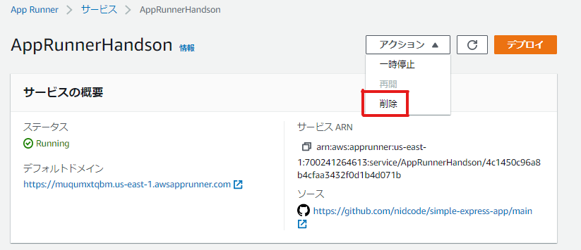
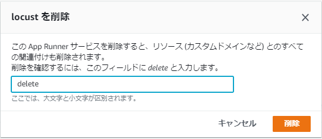
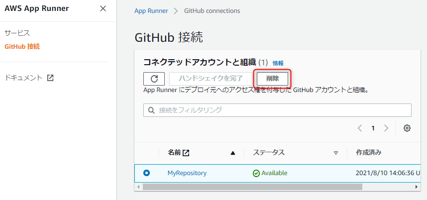
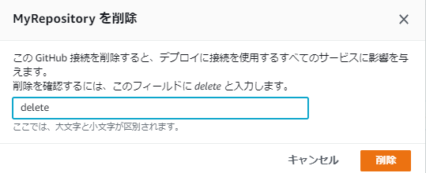

# ハンズオン環境の削除

## 1. サービスの削除
 - サービスの画面から削除したいサービスを選択します
 - **アクション** ＞ **削除** をクリックします

 

 - 確認画面では指示に従って削除しましょう

 

## 2. GitHub接続の削除
 - GitHub 接続の画面から、今回作成した接続名を選択し、 **削除** をクリックします



 - 確認画面では指示に従って削除しましょう



## 3. ForkしたGitHubリポジトリの削除
 - ハンズオンでForkした以下のGitHubリポジトリを削除します
   - simple-express-app
   - locust_sample
  1. 削除対象のリポジトリの **Settings** タブをクリックする
  1. 画面の一番下にある **Delete this repository** ボタンをクリックする
  1. **Are you absolutely sure?** というタイトルのポップアップが表示されるので、削除対象のリポジトリを入力した上で **I understand the consequences, delete this repository** ボタンをクリックする

```
以上で環境の削除は完了です
お疲れさまでした！
```