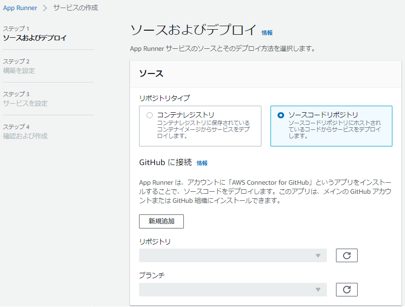
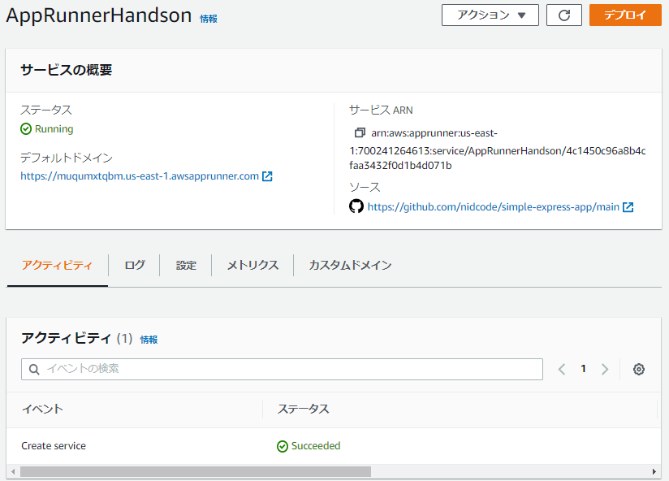

# AWS APP Runner ハンズオンシナリオ

```
このハンズオンでは
 - App Runnerの構築
 - アプリケーションの変更によるデプロイ
 - オートスケールのテスト
が実施できます
```

## 1. サンプルアプリケーションのデプロイ
### 1-1. Gitリポジトリのフォーク  
[@hkamedaさんのリポジトリ](https://github.com/harunobukameda/simple-express-app)からサンプルアプリケーションを自分のアカウントにフォークします

 

### 1-2. App Runnnerの作成  
 - [App Runner](https://console.aws.amazon.com/apprunner/)にアクセスします
 - **App Runner サービスを作成**をクリックします
 

### 1-3. App Runnerの設定
#### 1-3-1. ソースおよびデプロイ
 - ソース：ソースコードリポジトリを選択し、GitHubに接続の **新規追加** ボタンをクリックします

 

 - この画面が表示された場合は、**Authorize AWS Connector for GitHub** をクリックします
 - **Create a new connection** の画面になった場合は[こちら](./handson.md#リポジトリの選択)の手順に進みます 

 

 - **GitHubアプリケーションが選択できない場合**
 - **別のアプリケーションをインストールする** をクリックします

 

 - 接続したいアカウントを選択します

 

 - **All repositories** を選択し、**Install** をクリックします

 

#### リポジトリの選択
 - 接続名に任意の名前を入力します
 - GitHubアプリケーションに、自分のアカウントが自動選択されます

 

 - 作成した接続名を選択します
 - リポジトリ: 1-1.でフォークしたリポジトリを選択
 - ブランチ: main

 

 - デプロイ設定 自動

 - すべて入力したら **次へ** をクリックします

#### 1-3-2. 構築を設定
 - **ここで全ての設定を構成する** を選択します
 - ランタイム: Node.js 12
 - 構築コマンド: npm install
 - 開始コマンド: node index.js
 - ポート: 3000
 
 

 - **次へ** をクリックします

#### 1-3-3. サービスを設定
 - サービス名に任意の名前を入力して **次へ** をクリックします
 

#### 1-3-4. 確認および作成
 - 一番下までスクロールし、 **作成とデプロイ** をクリックします

```
おめでとうございます！これでApp Runnerの設定が終わりました。
デプロイが終わるまでコーヒーでも飲みながらTwitterにApp Runnerにデビューできたことを書き込んだりしてみてはいかがでしょう？
ツイートの際は、#jawsug #jawsugyokohamaのハッシュタグもご一緒に。
```

 - デプロイされると、ステータスが **Running** に変わります

 

 - デフォルトドメインのリンクをクリックすると、アプリケーションが表示されます

## 2. アプリケーションの更新
ソースコードを変更して、自動デプロイの動作を確認していきます
### 2-1. ブランチの作成
 - 新しいブランチを作成して下さい

 

### 2-2. ソースコードの修正

 - index.jsをクリックします
 - 編集アイコンをクリックします
 - Hello World！をHello World2！へ変更します
 - **Commit Changes** をクリックします

 

 ```
 mainリポジトリではないので、まだ自動デプロイは動作しません。
 デプロイするために、ブランチをマージしていきましょう！
 ```

### 2-3. ブランチのマージ

  - **Compare & pull request** をクリックします

  

  - `マージ先` を `自分のリポジトリ` の `main` に変更します

  

  - **Create pull request** をクリックします

  

  - **Merge pull request** をクリックします

  

  - **Confirm merge** をクリックします

```
これで自動デプロイが動きます
App Runnerの画面に戻って、デプロイが進行中かどうか確認しましょう
```


```
Cloud shellから以下のコマンドを実行するとデプロイされる様子が確認できます
App Runnerのデフォルトドメインは書き換えてください

while true; do curl -s https:// **App Runnerのデフォルトドメイン** /; echo $(date); sleep 0.5; done

デプロイ確認後、Ctrl + C で終了します
```

## 3. オートスケール

```
App Runnerはデプロイするだけでオートスケールするように構成されています
負荷テストをして実際にスケールアウトするか試してみましょう！
```

### 3-1. スケール設定の変更
 - スケールアウトしやすいように、スケールの設定をやさしくします
 - 1.で作成したサービスをクリックし、 **設定** タブを開きます。
 
 

 - 下の方にスクロールして、 **サービスを設定** の **編集** をクリックします

 - **Auto Scaling** ＞ **カスタム設定** ＞ **新規追加** をクリックします

 

 - **同時実行** を **1** にして、設定名に任意の名前を付けて保存します

 

 - 先ほど作成したコンフィグを選択し、同時実行数が変更されたことを核にして保存します

 

 ```
 設定変更待ちになるので、3-2. 負荷テスト用アプリケーション（Locust）のデプロイに進みましょう
 ```

### 3-2. 負荷テスト用アプリケーション（Locust）のデプロイ
 - [こちらのリポジトリ](https://github.com/nidcode/locust_sample)を自分のアカウントにフォークします
 - App Runnerで先ほどと同様にサービスを作成します
 - リポジトリ名 `locust_sample`
 - **構築の設定** では、`設定ファイルを使用` を選択します

 


 - デプロイされると、**デフォルトドメイン** のリンクをクリックすることでLocustの画面が表示されます (3-3. 負荷テストへ続く)

### 3-3. 負荷テスト
 - **Host** に 1. で作成したApp Runnerのデフォルトドメインをコピペします  
 ※【重要】 最後の **/** は入れないでください

 

 - **Start swarming** をクリックするとアプリケーションに対して負荷テストを実行します
 - **Charts** の画面を見ながらリクエストの状況を見てみましょう

 
 **Total Requests per Second** で緑色の線が変動していれば負荷テストは成功しています。  
 赤色の線が変動している場合は、Hostに入れた値が間違っていますので、上の方にある **New test** をクリックし、再度Hostを入力してから実行してみてください

### 3-4. スケールアウトの確認
 - 1.で作成したサービスのメトリクスタブを見ると、一番下に **Active instances** が表示されます
 - 十分に負荷がかかっていればインスタンスが増えていることが確認できます
 - また、Locustの画面で **Response Time** が大きく増えていかないことも確認できると思います

```
以上でスケールアウトのシナリオは終了です
お疲れさまでした
```